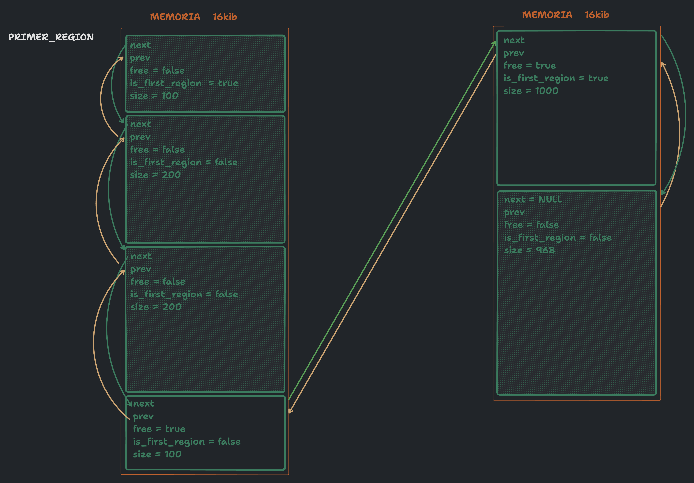
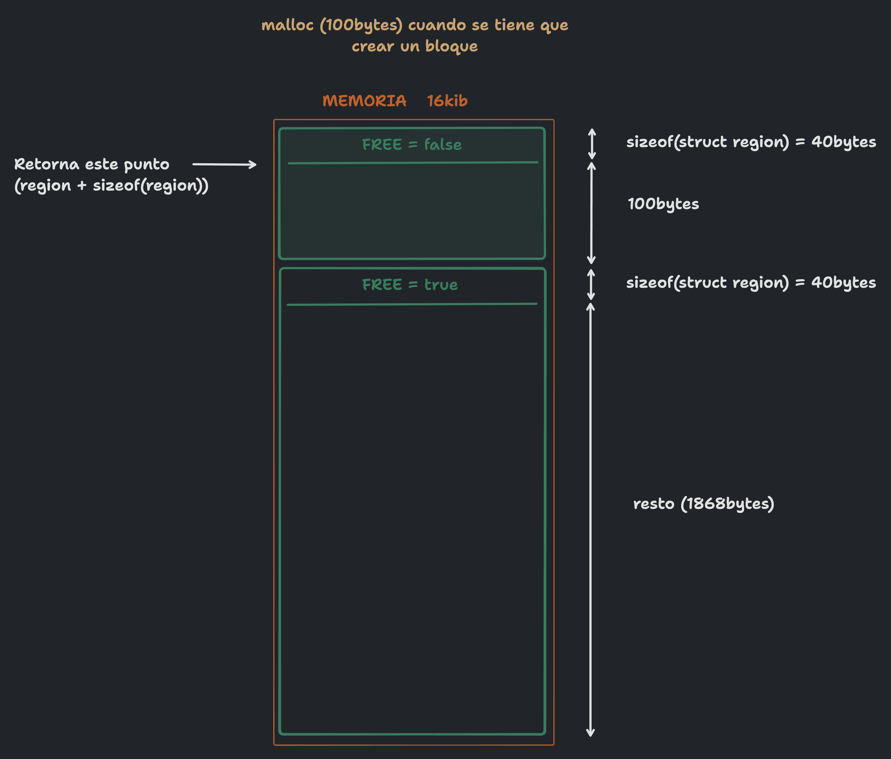

# malloc
Lugar para respuestas en prosa y documentación del TP.

Se eligio como tamaño minimo de region 40 bytes, ya que es el tamaño de un header de la misma. De esta forma los datos guardados ocupan como minimo lo mismo que el header, y no se gasta mas memoria en el header de los metadatos que los datos en si.

Al realizar un free sobre una region ya liberada, se printea un mensaje de error y se setea la variable errno a ENOMEM. Esto se hace para que el programa que llamo a free sepa que hubo un error y pueda actuar en consecuencia.

La implementacion se realizo utilizando el struct region como header de cada region. Este struct contiene un puntero a la siguiente region, un puntero a la region anterior, el tamaño de la region, un flag que indica si la region esta libre o no, y otro flag que indica si la region es la primera de un nuevo bloque o no.
-El tamaño de la region sirve para saber cuanto espacio se destino a la region pedida por el usuario.
-El flag de libre sirve para saber si la region esta libre o no.
-El flag de primera region sirve para saber si la region es la primera de un nuevo bloque o no. Esto sirve para saber que no se tiene que hacer coalesing entre ella y otras regiones(*); tambien sirve para, al hacer free, si es la unica region del bloque, liberar el bloque entero con munmap()(**).
-El puntero a la siguiente region sirve para poder recorrer la lista de regiones.
-El puntero a la region anterior sirve principalmente a la hora de hacer free para poder recorrer la lista de regiones y realizar el coalesing sin tener que recorrer siempre desde el principio ya que se puede acceder a las regiones anteriores y siguientes desde el puntero que se recibe como parametro del free.

*: El coalesing no se realiza por el flag de "primera region" en dos casos:
1- La region que se quiere liberar es la primera del bloque, y la anterior sea la que esta liberada. No se realiza ya que al haber un salto de bloque las regiones no estan contiguas en memoria.
2- La region que se quiere liberar tiene como siguiente region a la primera de otro bloque, y esta liberada. No se realiza ya que al haber un salto de bloque las regiones no estan contiguas en memoria.

**: Se identifica que la primera region es la unica del bloque, cuando esta region tiene el flag de "primera region" y no tiene siguiente o si la siguiente a su vez tambien tiene el flag de "primera region".

